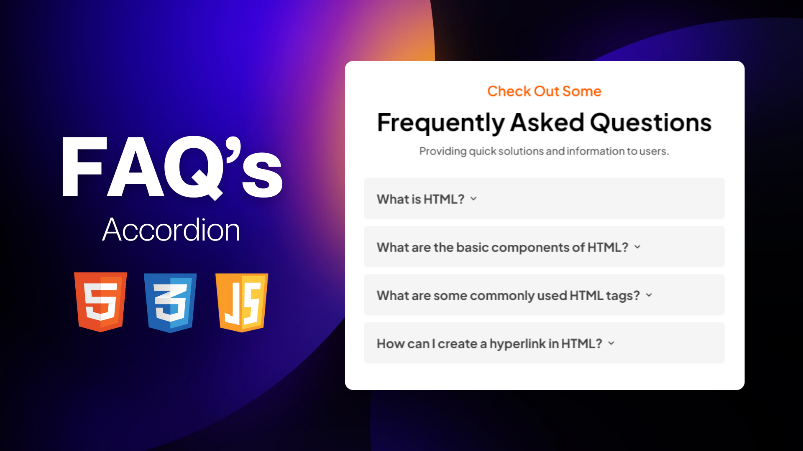

# Accordion Component

## Description
This is a simple accordion component created using HTML, CSS, and JavaScript. It allows users to expand and collapse sections to view additional content.

## Features
- Clickable Sections
- Customizable Content
- Responsive Design
- Hover Effect
- Expand/Collapse Animation
- Easy to Implement

## Getting Started
1. Clone this repository to your local machine.
2. Open the `index.html` file in a web browser to view the accordion component.
3. Customize the content within each accordion section by modifying the HTML markup in the `index.html` file.

## Support
For support or inquiries, please contact me via:
- Email: inquery.saurav@gmail.com
- LinkedIn: [Saurav Chaturvedi](https://www.linkedin.com/in/isaurav/)

## Preview

